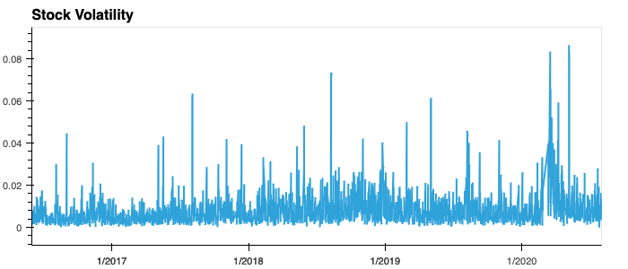

# Time_Series_HW [Google Colab Code](forecasting_net_prophet.ipynb)
## Forecasting Net Prophet

----
With over 200 million users, MercadoLibre is the most popular e-commerce site in Latin America. I have been tasked with analyzing the company's financial and user data in clever ways to make the company grow. I want to find out if the ability to predict search traffic can translate into the ability to successfully trade the stock.

----
## Part I

Step 1: Finding Unusual Patterns in Hourly Google Search Traffic

During the month of May 2020, MercadoLibre released its quarterly financial results. I have sliced the data for this month to see any unusual patterns in hourly google search traffic:

Step 2: Calculating the total search traffic for the month, and then comparing the value to the monthly median across all months.

> The traffic for the month of May 2020 has a Search Trends of 38,181 and the median search trends across the year is 35,172.5
> Comparing the data we see that during the month of May that MercadoLibre released its financial results, it has a higher Search Trends of 300,8.5 

Step 3: Mine the Search Traffic Data for Seasonality:

* Grouping the hourly search data to plot the average traffic by the day of the week:

* Using hvPlot, I was able to visualize the traffic as a heatmap, referencing the index.hour as the x-axis and the index.dayofweek as the y-axis. 

Does any day-of-week effect that you observe concentrate in just a few hours of that day?
> We are able to detect from the heatmap plot a high search trend during midnight (86 to 95.15) with the darkest colors between Monday and Friday!

Step : Grouping the search data by the week of the year. 

Does the search traffic tend to increase during the winter holiday period (weeks 40 through 52)?

> The search trend increases after the 40 week of the year and drops again after the holiday season.

## Part II

Step 1: Reading and plotting the stock prices data of Mercado Libre.

Step 2: Market events emerged during the year of 2020 that many companies found difficult. But, after the initial shock to global financial markets, new customers and revenue increased for e-commerce platforms. 

Slicing the data to just the first half of 2020 (2020-01 to 2020-06 in the DataFrame), and then using hvPlot to plot the data:

Do both time series indicate a common trend that’s consistent with this narrative?
> Both time series indicate a down trend. We see that in traffic searches and also the stock price.

Step 3: Creating a new column in the DataFrame named “Lagged Search Trends” that offsets, or shifts, the search traffic by one hour [.shift(1)]

Create two additional columns:

* “Stock Volatility”:

 Which holds an exponentially weighted four-hour rolling average of the company’s stock volatility

* Hourly Stock Return”:

 Which holds the percent change of the company's stock price on hourly basis

 

Step 4: Reviewing the time series correlation:

Correlation table of Stock Volatility, Lagged Search Trends, and Hourly Stock Return

Does a predictable relationship exist between the lagged search traffic and the stock volatility or between the lagged search traffic and the stock price returns?

>Through Correlation we are able to see the relationship between each indicator in the dataset.

* Here is a negative correlation between lagged search trend and stock volatility that means that when stock volatility is high the lagged search is low and vice versa. 

* There is also a positive corelation between lagged search traffic and the stock price returns, which means that when there is is spike in returns the is also a higher searching trend.

Step 5: Creating a Time Series Model with Prophet:

a) Setting up the Google search data for a Prophet forecasting model.

* Resetting the index so the date information is no longer the index
* Labeling the columns ds and y so that the syntax is recognized by Prophet
* Dropping an NaN values from the prophet_df DataFrame
* Viewing the first and last five rows of the mercado_prophet_df DataFrame

* Calling the Prophet function, store as an object: model_mercado_trends = Prophet()
* Fitting the time-series model: model_mercado_trends.fit(mercado_prophet_df)
* Creating a future dataframe to hold predictions: future_mercado_trends = model_mercado_trends.make_future_dataframe(periods=2000, freq="H")
* Viewing the last five rows of the future_mercado_trends DataFrame

> Here we are making predictions as far as 2000 hours (as we can see from the code the frequency of the data is hourly)
* Making predictions for the trend data using the future_mercado_trends DataFrame: forecast_mercado_trends = model_mercado_trends.predict(future_mercado_trends)

b) After estimating the model, I am plotting the forecast: 

How's the near-term forecast for the popularity of MercadoLibre?
> It shows that the Forecast for Popularity of MercadoLibre will increase in the new-term future!

c) Plotting each individual time series components of the model:

* Setting the index in the forecast_mercado_trends DataFrame to the ds datetime column
* Viewing the data
* Plotting the data using hvPlot to visualize the yhat, yhat_lower, and yhat_upper over the last 2000 hours:

Using the plot components function to visualize the forecast results for the mercado_trends DataFrame:

Question: What time of day exhibits the greatest popularity?

> Answer: The greatest popularity during the day is during midnight to early mornings.

Question: Which day of week gets the most search traffic?

> Answer: It looks like Tuesday is the day with the highest search traffic.

Question: What's the lowest point for search traffic in the calendar year?

> Answer: The lowest point or search traffic in the calendar year is at the end of October, and a spike back in the beginning of November.

## Part III

Step 1: Reading the daily historical sales (revenues) and then applying a Prophet model to the data:

> a) Applying a Facebook Prophet model to the data:
* Resetting the index so that date becomes a column in the DataFrame: mercado_sales_prophet_df = df_mercado_sales.reset_index()
* Adjusting the columns names to the Prophet syntax: mercado_sales_prophet_df = mercado_sales_prophet_df.rename(columns={"date":"ds", "Daily Sales":"y"})
* Visualize the DataFrame: mercado_sales_prophet_df

> b) Creating the model: mercado_sales_prophet_model = Prophet()

> c) Fitting the model: mercado_sales_prophet_model.fit(mercado_prophet_df)

> d) Making predictions for the sales each day over the next quarter: mercado_sales_prophet_forecast = mercado_sales_prophet_model.predict(mercado_sales_prophet_future)

Step 2: Interpreting the model output to identify any seasonal patterns in the company's revenue:

Question: For example, what are the peak revenue days?

> Answer: From the weekly revenue component plot we can see that Tuesday, Wednesday, Thursday and Friday are the days that bring the most revenues.

Step 3: Produce a sales forecast for the finance group. Give them a number for the expected total sales in the next quarter.

a) Produce a sales forecast for the finance division:

* Providing best case (yhat_upper), worst case (yhat_lower), and most likely (yhat) scenarios: mercado_sales_forecast_quarter = mercado_sales_prophet_forecast[["yhat", "yhat_lower", "yhat_upper"]]

* Creating a forecast_quarter Dataframe for the period 2020-07-01 to 2020-09-30: mercado_sales_forecast_quarter = mercado_sales_forecast_quarter.loc["2020-07-01":"2020-09-30"]

* Update the column names for the forecast_quarter DataFrame to match what the finance division is looking for: 

mercado_sales_forecast_quarter = mercado_sales_forecast_quarter.rename(
    columns=
{
    "yhat":"Most Likely Scenario",
    "yhat_upper":"Best Case Scenario",
    "yhat_lower":"Worst Case Scenario"
})

* Displayed the summed values for last 5 rows in the forecast_quarter DataFrame

* Based on the forecast information generated above, I am producing a sales forecast for the finance division, giving them a number for expected total sales next quarter. Include best and worst case scenarios, to better help the finance team plan:

